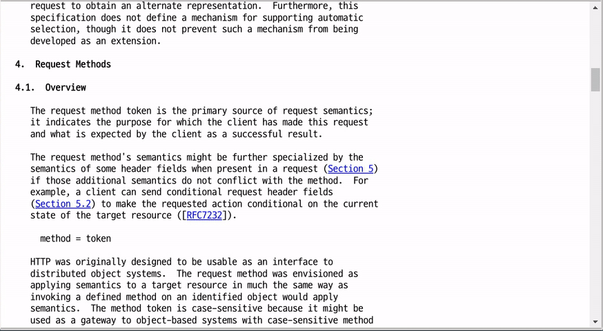

Copy as Markdown Quotation
==========================

In Chrome browser, copy text and paste it as markdown quotation.

Install
-------

1. Open `chrome://extensions/` with your Chrome browser.
2. Check 'Developer mode'
3. Add this directory as a chrome extension.

Usage
-----

1. Select text in a web page and do right-click.
2. Select 'Copy as Markdown quotation'.
3. Paste the text. 
